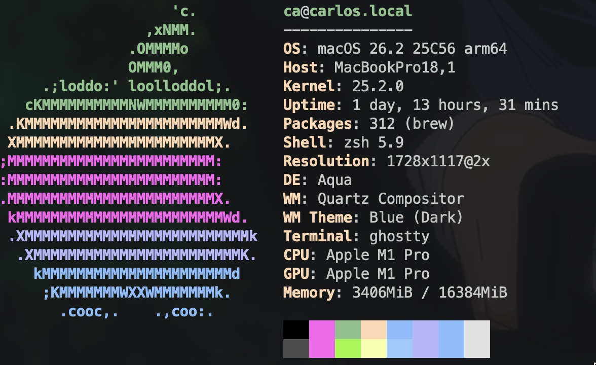

# dotfiles

Personal macOS development environment — configs, package list, system tweaks, and a one-shot bootstrap.



## What's here

| Path                 | What it is                                                                      |
| -------------------- | ------------------------------------------------------------------------------- |
| `setup.sh`           | Idempotent bootstrap — Homebrew, CLIs, GUI apps, configs, macOS tweaks          |
| `terminal/`          | `.zshrc` — aliases, env, oh-my-zsh + powerlevel10k                              |
| `git/`               | `.gitconfig`                                                                    |
| `tmux/`              | `.tmux.conf` (tpm + tmux-resurrect/continuum)                                   |
| `nvim/`              | Neovim config (lazy.nvim, mason, telescope, lspconfig)                          |
| `cursor/`            | Cursor settings/keybindings — synced via Cursor account, reference only         |
| `raycast/`           | Raycast settings export — import manually inside Raycast                        |
| `vscode/`            | Legacy VS Code profile blob                                                     |
| `browser/`           | Dated bookmark exports                                                          |
| `scripts/cpp-setup/` | Bootstrap a new C++ project in the current directory                            |
| `scripts/ytdl/`      | `dl-music` — yt-dlp each URL in `urls.txt` as mp3                               |

These files are **copies** of the live configs. `setup.sh` pushes repo → system. The `gxconf` shell function in `.zshrc` pulls system → repo.

## First-time setup on a fresh Mac

1. Install Xcode Command Line Tools:
   ```sh
   xcode-select --install
   ```
2. Clone this repo:
   ```sh
   git clone https://github.com/<you>/dotfiles ~/development/dotfiles
   ```
3. Run the bootstrap:
   ```sh
   cd ~/development/dotfiles && ./setup.sh
   ```
4. Restart your shell.

The script backs up any existing `~/.zshrc`, `~/.gitconfig`, `~/.tmux.conf`, and `~/.config/nvim` to `~/.dotfiles-backup` on first run.

## Manual steps the script can't automate

- **Raycast** — Preferences → Advanced → Import → `raycast/backup.rayconfig`
- **tmux plugins** — open tmux, press `prefix + I`
- **powerlevel10k** — run `p10k configure` for the prompt wizard

## Useful commands

**brew**
- `brew leaves` — installed formulas, no deps
- `brew outdated` — what needs updating

**git**
- `git branch | grep -v master | xargs git branch -D` — nuke all branches except master
- `git restore --source=origin/main path/to/file` — reset a file to origin

**cpp**
- `leaks --atExit -- ./your-program` — memory leak check (valgrind-ish)
